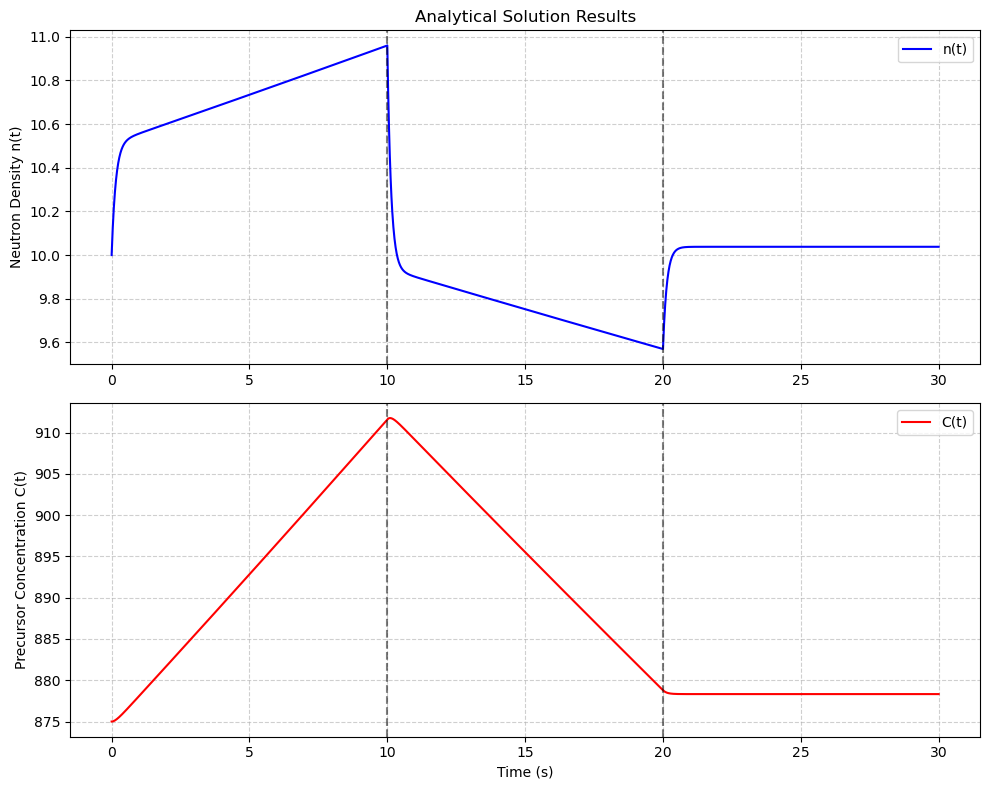

# ⚛️ Point Reactor Kinetics Analysis (One Group)

🔭 **Project Overview**

Welcome to the Point Reactor Kinetics analysis project. This repository houses a comprehensive study on solving the **One-Group Delayed Neutron** kinetic equations. It was developed as part of the *NEM 394 - Engineering Project II* course at **Hacettepe University, Department of Nuclear Engineering**.

The primary goal is to understand reactor behavior under varying reactivity conditions by implementing both exact analytical solutions and standard numerical integration techniques, highlighting the challenges posed by "stiff" differential equations.

***

📌 **Key Features**

* 🧮 **Analytical Solver:** Exact solution using matrix eigenvalue decomposition.
* 💻 **Numerical Methods:** Implementation and comparison of **Heun's Method** and **Runge-Kutta 4 (RK4)**.
* 📉 **Error Analysis:** Detailed study of absolute and relative errors versus time step size.
* ⚙️ **Stiffness Proof:** Mathematical quantification of the system's stiffness by analyzing time-scale disparities.

***

📘 **Mathematical Model**

The core of the simulation rests on these coupled ordinary differential equations representing neutron density ($n$) and precursor concentration ($C$):

$$\frac{dn}{dt} = \frac{\rho(t) - \beta}{\Lambda} n + \lambda C$$
$$\frac{dC}{dt} = \frac{\beta}{\Lambda} n - \lambda C$$

**Simulation Parameters:**
* $\beta = 0.007$ (Delayed fraction)
* $\lambda = 0.08 \, s^{-1}$ (Decay constant)
* $\Lambda = 10^{-3} \, s$ (Generation time)
* **Reactivity Scenario:** A step-up ($0.05\beta$) at t=0, followed by a step-down ($-0.05\beta$) at t=10s, returning to equilibrium at t=20s.

***

📊 **Visual Demonstration**

The plot below visualizes the system's response to the reactivity steps described above.

It clearly illustrates the fundamental concept of reactor kinetics: the neutron density ($n$) responds immediately to reactivity jumps, while the precursor concentration ($C$) acts as inertia, responding much slower. This difference in response speeds is the visual representation of the system's **stiffness**.

***

🚀 **Installation & Usage**

Follow these steps to run the simulation environment on your local machine.

**1. Prerequisites**
Ensure you have Python 3 installed along with these scientific libraries:

    pip install numpy matplotlib

**2. Clone and Run**
Clone the repository and execute the main script:

    git clone https://github.com/yourusername/point-reactor-kinetics.git
    cd point-reactor-kinetics
    python main.py

*(Note: If your main python file has a different name, replace `main.py` with your actual filename.)*

***

✅ **Results & Key Findings**

Based on the computational analysis reported in this project:

* **RK4 Superiority:** The Runge-Kutta 4 method provided vastly superior accuracy compared to Heun's method. At a time step of $h=0.01s$, RK4 achieved errors around $10^{-8}$, while Heun was in the range of $10^{-3}$.
* **Stiffness Quantified:** The system is severely stiff. The rate of change for neutrons ($dn/dt$) was calculated to be ~143 times faster than precursors ($dC/dt$) immediately following a step. The ratio between the system's eigenvalues is approximately **1620**, confirming the necessity for robust numerical solvers.

***

🎓 **License & Contact**

**Developer:** Emre Sakarya
**Institution:** Hacettepe University - Nuclear Engineering
**Date:** January 2026

*This project is intended for academic and educational purposes.*
*For detailed physics and derivations, please refer to the [Project Report](https://github.com/EmreSakarya/point-reactor-kinetics-analysis/blob/main/Point_Reactor_Kinetics_Report.pdf).*
